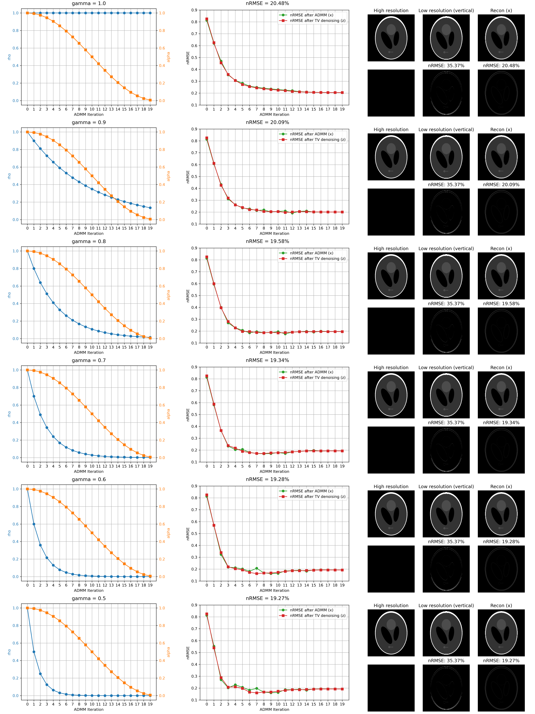
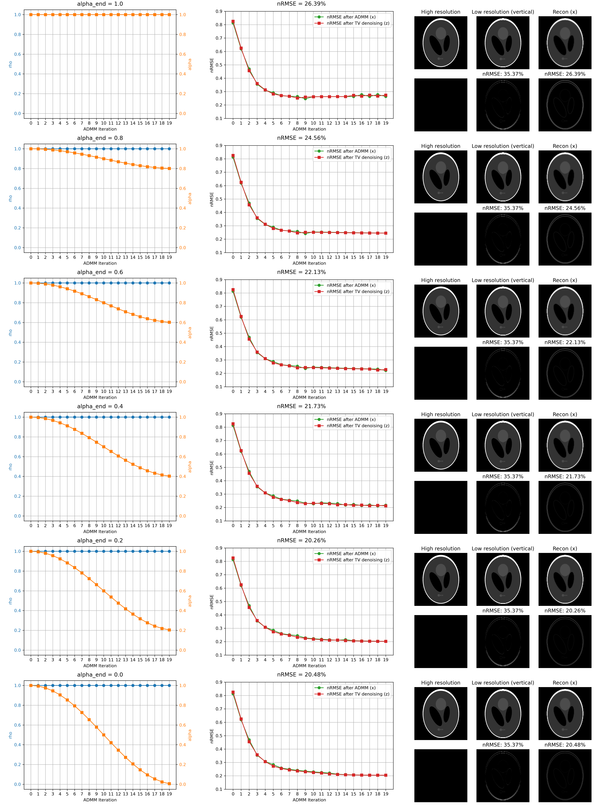

ADMM Phantom Study
==================

Introduction
------------

The repository contains a script that demonstrate the effect of different parameter schedules
for plug-and-play alternating direction method of multipliers (ADMM) on its convergence. 
To facilitate discussion, I will first briefly describe how I implemented the ADMM algorithm.

Method
------

Each ADMM iteration consists of three steps:
1. **x-update**: Solve the minimization problem for the primal variable \(x\) while keeping the dual variable \(z\) fixed:
    

    $$x^{(k+1)} = \underset{x}{\arg\min} f(x) + \frac{\rho^{(k+1)}}{2} \bigl\Vert x - \bigl(z^{(k)} - u^{(k)}\bigr) \bigr\Vert_2^2.$$
    

2. **z-update**: Solve the minimization problem for the dual variable \(z\) while keeping the primal variable \(x\) fixed:
    

    $$z^{(k+1)} = \underset{z}{\arg\min} R(z) + \frac{\rho^{(k+1)}}{2} \bigl\Vert z - \bigl(x^{(k+1)} + u^{(k)}\bigr) \bigr\Vert_2^2,$$
    

    
    which, in our case, is replaced by a plug-and-play denoiser:
    

    $$\quad z^{(k+1)} = \mathcal{D}\Bigl(x^{(k+1)} + u^{(k)}\Bigr).$$
    

    
    But there is a relaxation parameter $\alpha$ that can be used to control the amount of denoising applied to the image:
    

    $$\quad z^{(k+1)} = \alpha^{(k+1)} \cdot \mathcal{D}\Bigl(x^{(k+1)} + u^{(k)}\Bigr) + \Bigl(1 - \alpha^{(k+1)}\Bigr) \cdot \Bigl(x^{(k+1)} + u^{(k)}\Bigr).$$
    

3. **u-update**: Update the dual variable \(u\):
    

    $$u^{(k+1)} = u^{(k)} + \Bigl( x^{(k+1)} - z^{(k+1)} \Bigr)$$
    

    
Now, I want to explore the effect of a $\rho$ schedule and a $\alpha$ schedule on the convergence of the algorithm. Especially, I am interested in the case where the denoiser has *fixed strength*, i.e., does not have a tunable nob for the amount of denoising it does and where the denoiser is *somewhat biased* and *somewhat overly smoothing*.

One might argue that an increasing $\rho$ schedule is a good idea, because a larger $\rho$ draws the primal variables $x$ and $z$ closer to each other which eventually leads to a fixed-point convergence. However, I argue (although I didn't believe this is the case either at the very beginning) that a decreasing $\rho$ schedule in our specific case is a better idea. The important observation is that our denoiser of interest is somewhat too strong. A large $\rho$ pulls $x$ towards $z$ at the beginning. But as we progress, one would assume that the solution is already close enough, so we want the denoiser to be less dominant. And this is done by decreasing $\rho$. I will try the following $\rho$ schedule:

$$\rho^{(k)} = \rho_0 \cdot \gamma^k, \quad \gamma \in (0,1).$$

Now, similarly, notice that as $\alpha \to 0$, the strength of the denoiser is reduced. So, it is reasonable to assume that a decreasing $\alpha$ schedule is also a good idea. Given initial value $\alpha_0$, final value $\alpha_1$, and maximum number of ADMM iterations $K$, a cosine annealing schedule is explored:

$$\alpha^{(k)} = \frac{1}{2} \cdot \Bigl( \alpha_0 + \alpha_1 \Bigr) + \frac{1}{2} \cdot \Bigl( \alpha_0 - \alpha_1 \Bigr) \cdot \cos\Bigl(\pi \cdot \frac{k}{K}\Bigr), \quad \alpha_0, \alpha_1 \in [0,1]$$

Result
------

For all experiments, I will fix the maximum number of ADMM iterations $K = 20$. 

For $\rho$ schedule, we fix $\rho_0 = 1.0$ and try $\gamma = 1.0, 0.9, 0.8, 0.7, 0.6, 0.5$.

For $\alpha$ schedule, we fix $\alpha_0 = 1.0$, and try $\alpha_1 = 0.0, 0.2, 0.4, 0.6, 0.8, 1.0$.

Conclusion
----------

Both work.

Discussion
----------

Only an exponential schedule for $\rho$ and a cosine annealing schedule for $\alpha$ are explored but other non-increasing scheduling methods should also work equivalently well, e.g., a linear schedule.
